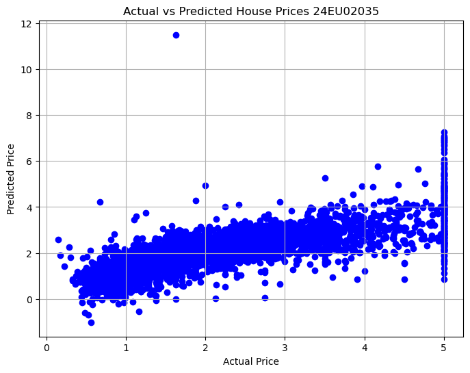
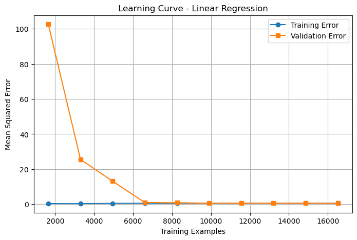

```python
# Import libraries
import pandas as pd
import numpy as np
import matplotlib.pyplot as plt
import seaborn as sns
from sklearn.datasets import fetch_california_housing
from sklearn.model_selection import train_test_split
from sklearn.linear_model import LinearRegression
from sklearn.metrics import mean_squared_error, mean_absolute_error, r2_score
housing = fetch_california_housing()
df = pd.DataFrame(housing.data, columns=housing.feature_names)
df['PRICE'] = housing.target
print(df.head())
# Features and Target
X = df.drop('PRICE', axis=1)
y = df['PRICE']
# Split dataset
X_train, X_test, y_train, y_test = train_test_split(
    X, y,
    test_size=0.2,
    random_state=42
)
#Create Model
model = LinearRegression()
# Train Model
model.fit(X_train, y_train)
# Predict
y_pred = model.predict(X_test)
# Evaluation
print("Mean Absolute Error :", mean_absolute_error(y_test, y_pred))
print("Mean Squared Error  :", mean_squared_error(y_test, y_pred))
print("Root Mean Squared Error :", np.sqrt(mean_squared_error(y_test, y_pred)))
print("R2 Score :", r2_score(y_test, y_pred))
# Regression Coefficients
coeff = pd.DataFrame(model.coef_, X.columns, columns=['Coefficient'])
print(coeff)
# Plot Actual vs Predicted
plt.figure(figsize=(8,6))
plt.scatter(y_test, y_pred, color='blue')
plt.xlabel("Actual Price")
plt.ylabel("Predicted Price")
plt.title("Actual vs Predicted House Prices 24EU02035")
plt.grid(True)

plt.show()
```

       MedInc  HouseAge  AveRooms  AveBedrms  Population  AveOccup  Latitude  \
    0  8.3252      41.0  6.984127   1.023810       322.0  2.555556     37.88   
    1  8.3014      21.0  6.238137   0.971880      2401.0  2.109842     37.86   
    2  7.2574      52.0  8.288136   1.073446       496.0  2.802260     37.85   
    3  5.6431      52.0  5.817352   1.073059       558.0  2.547945     37.85   
    4  3.8462      52.0  6.281853   1.081081       565.0  2.181467     37.85   
    
       Longitude  PRICE  
    0    -122.23  4.526  
    1    -122.22  3.585  
    2    -122.24  3.521  
    3    -122.25  3.413  
    4    -122.25  3.422  
    Mean Absolute Error : 0.5332001304956557
    Mean Squared Error  : 0.5558915986952442
    Root Mean Squared Error : 0.7455813830127763
    R2 Score : 0.575787706032451
                Coefficient
    MedInc         0.448675
    HouseAge       0.009724
    AveRooms      -0.123323
    AveBedrms      0.783145
    Population    -0.000002
    AveOccup      -0.003526
    Latitude      -0.419792
    Longitude     -0.433708
    


    

    


```python
# Import required libraries
import pandas as pd
import numpy as np

from sklearn.datasets import fetch_openml
from sklearn.model_selection import train_test_split
from sklearn.preprocessing import StandardScaler
from sklearn.svm import SVR
from sklearn.tree import DecisionTreeRegressor
from sklearn.metrics import mean_squared_error, mean_absolute_error, r2_score

# -----------------------------
# Load Boston Housing Dataset
# -----------------------------
boston = fetch_openml(name="boston", version=1, as_frame=True)

X = boston.data
y = boston.target.astype(float)

# -----------------------------
# Split the dataset
# -----------------------------
X_train, X_test, y_train, y_test = train_test_split(
    X, y, test_size=0.2, random_state=42
)

# -----------------------------
# Feature Scaling (Required for SVR)
# -----------------------------
scaler = StandardScaler()

X_train_scaled = scaler.fit_transform(X_train)
X_test_scaled = scaler.transform(X_test)

# -----------------------------
# Support Vector Regression
# -----------------------------
svr = SVR(kernel='rbf')
svr.fit(X_train_scaled, y_train)

svr_pred = svr.predict(X_test_scaled)

# -----------------------------
# Decision Tree Regression
# -----------------------------
dt = DecisionTreeRegressor(random_state=42)
dt.fit(X_train, y_train)

dt_pred = dt.predict(X_test)

# -----------------------------
# Evaluation Function
# -----------------------------
def evaluate_model(name, y_true, y_pred):
    mse = mean_squared_error(y_true, y_pred)
    mae = mean_absolute_error(y_true, y_pred)
    rmse = np.sqrt(mse)
    r2 = r2_score(y_true, y_pred)

    print(f"\n{name} Performance")
    print("-" * 30)
    print("MAE :", round(mae, 3))
    print("MSE :", round(mse, 3))
    print("RMSE:", round(rmse, 3))
    print("R2 Score:", round(r2, 3))

# -----------------------------
# Compare Models
# -----------------------------
evaluate_model("Support Vector Regression", y_test, svr_pred)
evaluate_model("Decision Tree Regression", y_test, dt_pred)
```

    
    Support Vector Regression Performance
    ------------------------------
    MAE : 2.732
    MSE : 25.669
    RMSE: 5.066
    R2 Score: 0.65
    
    Decision Tree Regression Performance
    ------------------------------
    MAE : 2.394
    MSE : 10.416
    RMSE: 3.227
    R2 Score: 0.858
    


```python
# Task 3: Evaluate Regression Models using Learning Curves and Error Metrics

import numpy as np
import matplotlib.pyplot as plt

from sklearn.datasets import fetch_california_housing
from sklearn.model_selection import train_test_split, learning_curve
from sklearn.linear_model import LinearRegression
from sklearn.metrics import (
    mean_absolute_error,
    mean_squared_error,
    r2_score
)

# Load dataset
data = fetch_california_housing()
X = data.data
y = data.target

# Split dataset
X_train, X_test, y_train, y_test = train_test_split(
    X, y, test_size=0.2, random_state=42
)

# Train model
model = LinearRegression()
model.fit(X_train, y_train)

# Predictions
y_pred = model.predict(X_test)

# Evaluation Metrics
mae = mean_absolute_error(y_test, y_pred)
mse = mean_squared_error(y_test, y_pred)
rmse = np.sqrt(mse)
r2 = r2_score(y_test, y_pred)

print("Model Evaluation")
print("----------------")
print(f"MAE  : {mae:.4f}")
print(f"MSE  : {mse:.4f}")
print(f"RMSE : {rmse:.4f}")
print(f"R² Score : {r2:.4f}")

# Learning Curve
train_sizes, train_scores, val_scores = learning_curve(
    model,
    X,
    y,
    cv=5,
    scoring="neg_mean_squared_error",
    train_sizes=np.linspace(0.1, 1.0, 10)
)

# Convert negative MSE to positive
train_error = -train_scores.mean(axis=1)
val_error = -val_scores.mean(axis=1)

# Plot Learning Curve
plt.figure(figsize=(8, 5))
plt.plot(train_sizes, train_error, marker='o', label="Training Error")
plt.plot(train_sizes, val_error, marker='s', label="Validation Error")
plt.xlabel("Training Examples")
plt.ylabel("Mean Squared Error")
plt.title("Learning Curve - Linear Regression")
plt.legend()
plt.grid(True)
plt.show()
```

    Model Evaluation
    ----------------
    MAE  : 0.5332
    MSE  : 0.5559
    RMSE : 0.7456
    R² Score : 0.5758
    


    

    


```python

```
