```python
import warnings
```


```python
warnings.filterwarnings("ignore")
```


```python
import pandas as pd
```


```python
import numpy as np
```


```python
from sklearn.datasets import load_iris
```


```python
from sklearn.preprocessing import StandardScaler
```


```python
raw_iris = load_iris()
```


```python
features = raw_iris.feature_names
```


```python
X_raw = raw_iris.data
```


```python
y_true = raw_iris.target
```


```python
scaler = StandardScaler()
```


```python
X_scaled = scaler.fit_transform(X_raw)
```


```python
iris_df = pd.DataFrame(data=X_scaled, columns=features)
```


```python
iris_df['species_id'] = y_true
```


```python
species_map = {i: name for i, name in enumerate(raw_iris.target_names)}
```


```python
iris_df['species_name'] = iris_df['species_id'].map(species_map)
```


```python
print("Standardized dataset dimensions:", X_scaled.shape)
```

    Standardized dataset dimensions: (150, 4)
    


```python
print("\nFirst 3 rows of standardized dataset:")
```

    
    First 3 rows of standardized dataset:
    


```python
print(iris_df.head(3))
```

       sepal length (cm)  sepal width (cm)  petal length (cm)  petal width (cm)  \
    0          -0.900681          1.019004          -1.340227         -1.315444   
    1          -1.143017         -0.131979          -1.340227         -1.315444   
    2          -1.385353          0.328414          -1.397064         -1.315444   
    
       species_id species_name  
    0           0       setosa  
    1           0       setosa  
    2           0       setosa  
    


```python
cov_matrix = np.cov(X_scaled.T)
```


```python
print("Covariance Matrix:\n", cov_matrix)
```

    Covariance Matrix:
     [[ 1.00671141 -0.11835884  0.87760447  0.82343066]
     [-0.11835884  1.00671141 -0.43131554 -0.36858315]
     [ 0.87760447 -0.43131554  1.00671141  0.96932762]
     [ 0.82343066 -0.36858315  0.96932762  1.00671141]]
    


```python
eigenvalues, eigenvectors = np.linalg.eig(cov_matrix)
```


```python
print("\nEigenvalues (Variance components):\n", eigenvalues)
```

    
    Eigenvalues (Variance components):
     [2.93808505 0.9201649  0.14774182 0.02085386]
    


```python
print("\nEigenvectors (Principal Axes):\n", eigenvectors)
```

    
    Eigenvectors (Principal Axes):
     [[ 0.52106591 -0.37741762 -0.71956635  0.26128628]
     [-0.26934744 -0.92329566  0.24438178 -0.12350962]
     [ 0.5804131  -0.02449161  0.14212637 -0.80144925]
     [ 0.56485654 -0.06694199  0.63427274  0.52359713]]
    


```python
from sklearn.decomposition import PCA
```


```python
pca_model = PCA(n_components=2, random_state=42)
```


```python
X_pca = pca_model.fit_transform(X_scaled)
```


```python
pca_df = pd.DataFrame(data=X_pca, columns=['PC_1', 'PC2'])
```


```python
pca_df['species_name'] = iris_df['species_name']
```


```python
print("Transformed PCA space dimensions:", X_pca.shape)
```

    Transformed PCA space dimensions: (150, 2)
    


```python
print("\nFirst 3 projected coordinates:")
```

    
    First 3 projected coordinates:
    


```python
print(pca_df.head(3))
```

           PC_1       PC2 species_name
    0 -2.264703  0.480027       setosa
    1 -2.080961 -0.674134       setosa
    2 -2.364229 -0.341908       setosa
    


```python
import matplotlib.pyplot as plt
```


```python
import seaborn as sns
```


```python
plt.figure(figsize=(6, 4))
```


    <Figure size 600x400 with 0 Axes>


    <Figure size 600x400 with 0 Axes>


```python
sns.scatterplot(data=pca_df, x='PC_1', y='PC2', hue='species_name', palette='Set1', s=60)
```


    <Axes: xlabel='PC_1', ylabel='PC2'>


    
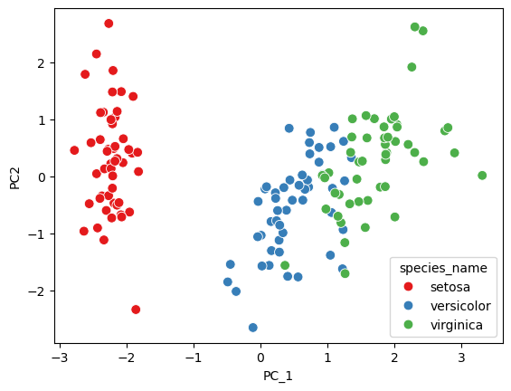
    


```python
plt.title("2-Component PCA Projection of Iris Dataset")
```


    Text(0.5, 1.0, '2-Component PCA Projection of Iris Dataset')


    
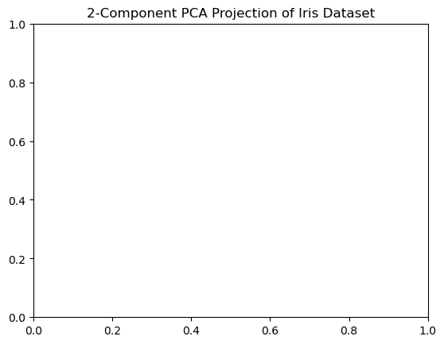
    


```python
plt.xlabel("Principal Component 1 (PC1)")
```


    Text(0.5, 0, 'Principal Component 1 (PC1)')


    
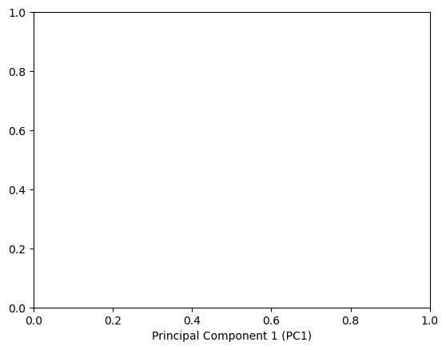
    


```python
plt.ylabel("Principal Component 2 (PC2)")
```


    Text(0, 0.5, 'Principal Component 2 (PC2)')


    
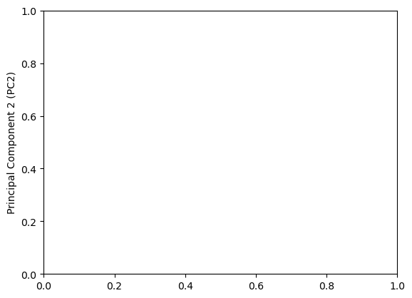
    


```python
plt.legend(title='True Species')
```

    No artists with labels found to put in legend.  Note that artists whose label start with an underscore are ignored when legend() is called with no argument.
    


    <matplotlib.legend.Legend at 0x2b5cf164980>


    
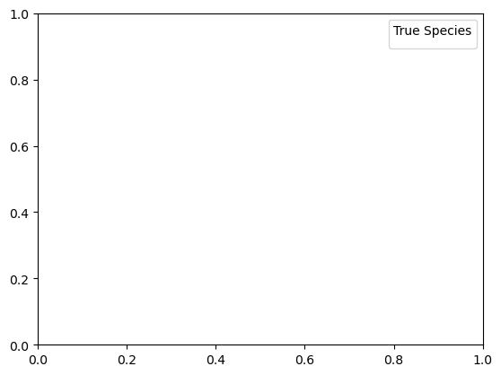
    


```python
plt.show()
```


```python
plt.figure(figsize=(6, 4))
sns.scatterplot(data=pca_df, x='PC_1', y='PC2', hue='species_name', palette='Set1', s=60)
plt.title("2-Component PCA Projection of Iris Dataset - 24EU02035")
plt.xlabel("Principal Component 1 (PC1)")
plt.ylabel("Principal Component 2 (PC2)")
plt.legend(title='True Species')
plt.show()
```


    
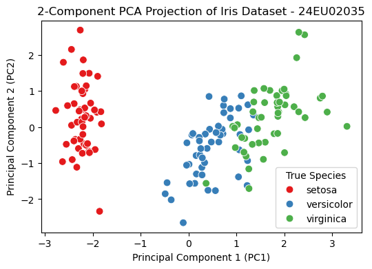
    


```python
explained_variance = pca_model.explained_variance_ratio_
```


```python
cumulative_variance = np.sum(explained_variance)
```


```python
print("Explained Variance per Component:")
```

    Explained Variance per Component:
    


```python
for i, var in enumerate(explained_variance):
    print(f"  PC{i+1}: {var*100:.2f}%")
```

      PC1: 72.96%
      PC2: 22.85%
    


```python
print(f"\nTotal Cumulative Variance Retained by 2 Components: {cumulative_variance*100:.2f}%")
```

    
    Total Cumulative Variance Retained by 2 Components: 95.81%
    


```python
import numpy as np
```


```python
   import pandas as pd
```


```python


```


```python
from sklearn.datasets import load_iris
```


```python
from sklearn.model_selection import train_test_split
```


```python
from sklearn.preprocessing import StandardScaler
```


```python
from sklearn.decomposition import PCA
```


```python
from sklearn.linear_model import LogisticRegression
```


```python
from sklearn.metrics import accuracy_score, classification_report, confusion_matrix

```


```python
iris = load_iris()
```


```python
X = iris.data  
```


```python
y = iris.target 
```


```python
feature_names = iris.feature_names
```


```python
target_names = iris.target_names
```


```python
print("Dataset Shape:", X.shape)
```

    Dataset Shape: (150, 4)
    


```python
print("Features:", feature_names)
```

    Features: ['sepal length (cm)', 'sepal width (cm)', 'petal length (cm)', 'petal width (cm)']
    


```python
print("Classes:", target_names)
```

    Classes: ['setosa' 'versicolor' 'virginica']
    


```python
X_train, X_test, y_train, y_test = train_test_split(
    X,
    y,
    test_size=0.20,
    random_state=42,
    stratify=y
)
```


```python
scaler = StandardScaler()
```


```python
X_train_scaled = scaler.fit_transform(X_train)
```


```python
X_test_scaled = scaler.transform(X_test)
```


```python
print("CLASSIFICATION WITHOUT PCA")
```

    CLASSIFICATION WITHOUT PCA
    


```python
model_without_pca = LogisticRegression(
    random_state=42,
    max_iter=1000
)
```


```python
model_without_pca.fit(
    X_train_scaled,
    y_train
)
```


<style>#sk-container-id-1 {
  /* Definition of color scheme common for light and dark mode */
  --sklearn-color-text: black;
  --sklearn-color-line: gray;
  /* Definition of color scheme for unfitted estimators */
  --sklearn-color-unfitted-level-0: #fff5e6;
  --sklearn-color-unfitted-level-1: #f6e4d2;
  --sklearn-color-unfitted-level-2: #ffe0b3;
  --sklearn-color-unfitted-level-3: chocolate;
  /* Definition of color scheme for fitted estimators */
  --sklearn-color-fitted-level-0: #f0f8ff;
  --sklearn-color-fitted-level-1: #d4ebff;
  --sklearn-color-fitted-level-2: #b3dbfd;
  --sklearn-color-fitted-level-3: cornflowerblue;

  /* Specific color for light theme */
  --sklearn-color-text-on-default-background: var(--sg-text-color, var(--theme-code-foreground, var(--jp-content-font-color1, black)));
  --sklearn-color-background: var(--sg-background-color, var(--theme-background, var(--jp-layout-color0, white)));
  --sklearn-color-border-box: var(--sg-text-color, var(--theme-code-foreground, var(--jp-content-font-color1, black)));
  --sklearn-color-icon: #696969;

  @media (prefers-color-scheme: dark) {
    /* Redefinition of color scheme for dark theme */
    --sklearn-color-text-on-default-background: var(--sg-text-color, var(--theme-code-foreground, var(--jp-content-font-color1, white)));
    --sklearn-color-background: var(--sg-background-color, var(--theme-background, var(--jp-layout-color0, #111)));
    --sklearn-color-border-box: var(--sg-text-color, var(--theme-code-foreground, var(--jp-content-font-color1, white)));
    --sklearn-color-icon: #878787;
  }
}

#sk-container-id-1 {
  color: var(--sklearn-color-text);
}

#sk-container-id-1 pre {
  padding: 0;
}

#sk-container-id-1 input.sk-hidden--visually {
  border: 0;
  clip: rect(1px 1px 1px 1px);
  clip: rect(1px, 1px, 1px, 1px);
  height: 1px;
  margin: -1px;
  overflow: hidden;
  padding: 0;
  position: absolute;
  width: 1px;
}

#sk-container-id-1 div.sk-dashed-wrapped {
  border: 1px dashed var(--sklearn-color-line);
  margin: 0 0.4em 0.5em 0.4em;
  box-sizing: border-box;
  padding-bottom: 0.4em;
  background-color: var(--sklearn-color-background);
}

#sk-container-id-1 div.sk-container {
  /* jupyter's `normalize.less` sets `[hidden] { display: none; }`
     but bootstrap.min.css set `[hidden] { display: none !important; }`
     so we also need the `!important` here to be able to override the
     default hidden behavior on the sphinx rendered scikit-learn.org.
     See: https://github.com/scikit-learn/scikit-learn/issues/21755 */
  display: inline-block !important;
  position: relative;
}

#sk-container-id-1 div.sk-text-repr-fallback {
  display: none;
}

div.sk-parallel-item,
div.sk-serial,
div.sk-item {
  /* draw centered vertical line to link estimators */
  background-image: linear-gradient(var(--sklearn-color-text-on-default-background), var(--sklearn-color-text-on-default-background));
  background-size: 2px 100%;
  background-repeat: no-repeat;
  background-position: center center;
}

/* Parallel-specific style estimator block */

#sk-container-id-1 div.sk-parallel-item::after {
  content: "";
  width: 100%;
  border-bottom: 2px solid var(--sklearn-color-text-on-default-background);
  flex-grow: 1;
}

#sk-container-id-1 div.sk-parallel {
  display: flex;
  align-items: stretch;
  justify-content: center;
  background-color: var(--sklearn-color-background);
  position: relative;
}

#sk-container-id-1 div.sk-parallel-item {
  display: flex;
  flex-direction: column;
}

#sk-container-id-1 div.sk-parallel-item:first-child::after {
  align-self: flex-end;
  width: 50%;
}

#sk-container-id-1 div.sk-parallel-item:last-child::after {
  align-self: flex-start;
  width: 50%;
}

#sk-container-id-1 div.sk-parallel-item:only-child::after {
  width: 0;
}

/* Serial-specific style estimator block */

#sk-container-id-1 div.sk-serial {
  display: flex;
  flex-direction: column;
  align-items: center;
  background-color: var(--sklearn-color-background);
  padding-right: 1em;
  padding-left: 1em;
}


/* Toggleable style: style used for estimator/Pipeline/ColumnTransformer box that is
clickable and can be expanded/collapsed.
- Pipeline and ColumnTransformer use this feature and define the default style
- Estimators will overwrite some part of the style using the `sk-estimator` class
*/

/* Pipeline and ColumnTransformer style (default) */

#sk-container-id-1 div.sk-toggleable {
  /* Default theme specific background. It is overwritten whether we have a
  specific estimator or a Pipeline/ColumnTransformer */
  background-color: var(--sklearn-color-background);
}

/* Toggleable label */
#sk-container-id-1 label.sk-toggleable__label {
  cursor: pointer;
  display: block;
  width: 100%;
  margin-bottom: 0;
  padding: 0.5em;
  box-sizing: border-box;
  text-align: center;
}

#sk-container-id-1 label.sk-toggleable__label-arrow:before {
  /* Arrow on the left of the label */
  content: "▸";
  float: left;
  margin-right: 0.25em;
  color: var(--sklearn-color-icon);
}

#sk-container-id-1 label.sk-toggleable__label-arrow:hover:before {
  color: var(--sklearn-color-text);
}

/* Toggleable content - dropdown */

#sk-container-id-1 div.sk-toggleable__content {
  max-height: 0;
  max-width: 0;
  overflow: hidden;
  text-align: left;
  /* unfitted */
  background-color: var(--sklearn-color-unfitted-level-0);
}

#sk-container-id-1 div.sk-toggleable__content.fitted {
  /* fitted */
  background-color: var(--sklearn-color-fitted-level-0);
}

#sk-container-id-1 div.sk-toggleable__content pre {
  margin: 0.2em;
  border-radius: 0.25em;
  color: var(--sklearn-color-text);
  /* unfitted */
  background-color: var(--sklearn-color-unfitted-level-0);
}

#sk-container-id-1 div.sk-toggleable__content.fitted pre {
  /* unfitted */
  background-color: var(--sklearn-color-fitted-level-0);
}

#sk-container-id-1 input.sk-toggleable__control:checked~div.sk-toggleable__content {
  /* Expand drop-down */
  max-height: 200px;
  max-width: 100%;
  overflow: auto;
}

#sk-container-id-1 input.sk-toggleable__control:checked~label.sk-toggleable__label-arrow:before {
  content: "▾";
}

/* Pipeline/ColumnTransformer-specific style */

#sk-container-id-1 div.sk-label input.sk-toggleable__control:checked~label.sk-toggleable__label {
  color: var(--sklearn-color-text);
  background-color: var(--sklearn-color-unfitted-level-2);
}

#sk-container-id-1 div.sk-label.fitted input.sk-toggleable__control:checked~label.sk-toggleable__label {
  background-color: var(--sklearn-color-fitted-level-2);
}

/* Estimator-specific style */

/* Colorize estimator box */
#sk-container-id-1 div.sk-estimator input.sk-toggleable__control:checked~label.sk-toggleable__label {
  /* unfitted */
  background-color: var(--sklearn-color-unfitted-level-2);
}

#sk-container-id-1 div.sk-estimator.fitted input.sk-toggleable__control:checked~label.sk-toggleable__label {
  /* fitted */
  background-color: var(--sklearn-color-fitted-level-2);
}

#sk-container-id-1 div.sk-label label.sk-toggleable__label,
#sk-container-id-1 div.sk-label label {
  /* The background is the default theme color */
  color: var(--sklearn-color-text-on-default-background);
}

/* On hover, darken the color of the background */
#sk-container-id-1 div.sk-label:hover label.sk-toggleable__label {
  color: var(--sklearn-color-text);
  background-color: var(--sklearn-color-unfitted-level-2);
}

/* Label box, darken color on hover, fitted */
#sk-container-id-1 div.sk-label.fitted:hover label.sk-toggleable__label.fitted {
  color: var(--sklearn-color-text);
  background-color: var(--sklearn-color-fitted-level-2);
}

/* Estimator label */

#sk-container-id-1 div.sk-label label {
  font-family: monospace;
  font-weight: bold;
  display: inline-block;
  line-height: 1.2em;
}

#sk-container-id-1 div.sk-label-container {
  text-align: center;
}

/* Estimator-specific */
#sk-container-id-1 div.sk-estimator {
  font-family: monospace;
  border: 1px dotted var(--sklearn-color-border-box);
  border-radius: 0.25em;
  box-sizing: border-box;
  margin-bottom: 0.5em;
  /* unfitted */
  background-color: var(--sklearn-color-unfitted-level-0);
}

#sk-container-id-1 div.sk-estimator.fitted {
  /* fitted */
  background-color: var(--sklearn-color-fitted-level-0);
}

/* on hover */
#sk-container-id-1 div.sk-estimator:hover {
  /* unfitted */
  background-color: var(--sklearn-color-unfitted-level-2);
}

#sk-container-id-1 div.sk-estimator.fitted:hover {
  /* fitted */
  background-color: var(--sklearn-color-fitted-level-2);
}

/* Specification for estimator info (e.g. "i" and "?") */

/* Common style for "i" and "?" */

.sk-estimator-doc-link,
a:link.sk-estimator-doc-link,
a:visited.sk-estimator-doc-link {
  float: right;
  font-size: smaller;
  line-height: 1em;
  font-family: monospace;
  background-color: var(--sklearn-color-background);
  border-radius: 1em;
  height: 1em;
  width: 1em;
  text-decoration: none !important;
  margin-left: 1ex;
  /* unfitted */
  border: var(--sklearn-color-unfitted-level-1) 1pt solid;
  color: var(--sklearn-color-unfitted-level-1);
}

.sk-estimator-doc-link.fitted,
a:link.sk-estimator-doc-link.fitted,
a:visited.sk-estimator-doc-link.fitted {
  /* fitted */
  border: var(--sklearn-color-fitted-level-1) 1pt solid;
  color: var(--sklearn-color-fitted-level-1);
}

/* On hover */
div.sk-estimator:hover .sk-estimator-doc-link:hover,
.sk-estimator-doc-link:hover,
div.sk-label-container:hover .sk-estimator-doc-link:hover,
.sk-estimator-doc-link:hover {
  /* unfitted */
  background-color: var(--sklearn-color-unfitted-level-3);
  color: var(--sklearn-color-background);
  text-decoration: none;
}

div.sk-estimator.fitted:hover .sk-estimator-doc-link.fitted:hover,
.sk-estimator-doc-link.fitted:hover,
div.sk-label-container:hover .sk-estimator-doc-link.fitted:hover,
.sk-estimator-doc-link.fitted:hover {
  /* fitted */
  background-color: var(--sklearn-color-fitted-level-3);
  color: var(--sklearn-color-background);
  text-decoration: none;
}

/* Span, style for the box shown on hovering the info icon */
.sk-estimator-doc-link span {
  display: none;
  z-index: 9999;
  position: relative;
  font-weight: normal;
  right: .2ex;
  padding: .5ex;
  margin: .5ex;
  width: min-content;
  min-width: 20ex;
  max-width: 50ex;
  color: var(--sklearn-color-text);
  box-shadow: 2pt 2pt 4pt #999;
  /* unfitted */
  background: var(--sklearn-color-unfitted-level-0);
  border: .5pt solid var(--sklearn-color-unfitted-level-3);
}

.sk-estimator-doc-link.fitted span {
  /* fitted */
  background: var(--sklearn-color-fitted-level-0);
  border: var(--sklearn-color-fitted-level-3);
}

.sk-estimator-doc-link:hover span {
  display: block;
}

/* "?"-specific style due to the `<a>` HTML tag */

#sk-container-id-1 a.estimator_doc_link {
  float: right;
  font-size: 1rem;
  line-height: 1em;
  font-family: monospace;
  background-color: var(--sklearn-color-background);
  border-radius: 1rem;
  height: 1rem;
  width: 1rem;
  text-decoration: none;
  /* unfitted */
  color: var(--sklearn-color-unfitted-level-1);
  border: var(--sklearn-color-unfitted-level-1) 1pt solid;
}

#sk-container-id-1 a.estimator_doc_link.fitted {
  /* fitted */
  border: var(--sklearn-color-fitted-level-1) 1pt solid;
  color: var(--sklearn-color-fitted-level-1);
}

/* On hover */
#sk-container-id-1 a.estimator_doc_link:hover {
  /* unfitted */
  background-color: var(--sklearn-color-unfitted-level-3);
  color: var(--sklearn-color-background);
  text-decoration: none;
}

#sk-container-id-1 a.estimator_doc_link.fitted:hover {
  /* fitted */
  background-color: var(--sklearn-color-fitted-level-3);
}
</style><div id="sk-container-id-1" class="sk-top-container"><div class="sk-text-repr-fallback"><pre>LogisticRegression(max_iter=1000, random_state=42)</pre><b>In a Jupyter environment, please rerun this cell to show the HTML representation or trust the notebook. <br />On GitHub, the HTML representation is unable to render, please try loading this page with nbviewer.org.</b></div><div class="sk-container" hidden><div class="sk-item"><div class="sk-estimator fitted sk-toggleable"><input class="sk-toggleable__control sk-hidden--visually" id="sk-estimator-id-1" type="checkbox" checked><label for="sk-estimator-id-1" class="sk-toggleable__label fitted sk-toggleable__label-arrow fitted">&nbsp;&nbsp;LogisticRegression<a class="sk-estimator-doc-link fitted" rel="noreferrer" target="_blank" href="https://scikit-learn.org/1.4/modules/generated/sklearn.linear_model.LogisticRegression.html">?<span>Documentation for LogisticRegression</span></a><span class="sk-estimator-doc-link fitted">i<span>Fitted</span></span></label><div class="sk-toggleable__content fitted"><pre>LogisticRegression(max_iter=1000, random_state=42)</pre></div> </div></div></div></div>


```python
y_pred_without_pca = model_without_pca.predict(
    X_test_scaled
)
```


```python
accuracy_without_pca = accuracy_score(
    y_test,
    y_pred_without_pca
)
```


```python
print("Accuracy without PCA:",
      accuracy_without_pca)
```

    Accuracy without PCA: 0.9333333333333333
    


```python
print("\nClassification Report:")
```

    
    Classification Report:
    


```python
print(
    classification_report(
        y_test,
        y_pred_without_pca,
        target_names=target_names
    )
)
```

                  precision    recall  f1-score   support
    
          setosa       1.00      1.00      1.00        10
      versicolor       0.90      0.90      0.90        10
       virginica       0.90      0.90      0.90        10
    
        accuracy                           0.93        30
       macro avg       0.93      0.93      0.93        30
    weighted avg       0.93      0.93      0.93        30
    
    


```python
print("CLASSIFICATION WITH PCA")
```

    CLASSIFICATION WITH PCA
    


```python
pca = PCA(
    n_components=2
)
```


```python
X_train_pca = pca.fit_transform(
    X_train_scaled
)
```


```python
X_test_pca = pca.transform(
    X_test_scaled
)
```


```python
print("Explained Variance Ratio:",
      pca.explained_variance_ratio_)
```

    Explained Variance Ratio: [0.72677234 0.23066667]
    


```python

print("Total Explained Variance:",
      pca.explained_variance_ratio_.sum())
```

    Total Explained Variance: 0.9574390106545367
    


```python
model_with_pca = LogisticRegression(
    random_state=42,
    max_iter=1000
)
```


```python
model_with_pca.fit(
    X_train_pca,
    y_train
)
```


<style>#sk-container-id-2 {
  /* Definition of color scheme common for light and dark mode */
  --sklearn-color-text: black;
  --sklearn-color-line: gray;
  /* Definition of color scheme for unfitted estimators */
  --sklearn-color-unfitted-level-0: #fff5e6;
  --sklearn-color-unfitted-level-1: #f6e4d2;
  --sklearn-color-unfitted-level-2: #ffe0b3;
  --sklearn-color-unfitted-level-3: chocolate;
  /* Definition of color scheme for fitted estimators */
  --sklearn-color-fitted-level-0: #f0f8ff;
  --sklearn-color-fitted-level-1: #d4ebff;
  --sklearn-color-fitted-level-2: #b3dbfd;
  --sklearn-color-fitted-level-3: cornflowerblue;

  /* Specific color for light theme */
  --sklearn-color-text-on-default-background: var(--sg-text-color, var(--theme-code-foreground, var(--jp-content-font-color1, black)));
  --sklearn-color-background: var(--sg-background-color, var(--theme-background, var(--jp-layout-color0, white)));
  --sklearn-color-border-box: var(--sg-text-color, var(--theme-code-foreground, var(--jp-content-font-color1, black)));
  --sklearn-color-icon: #696969;

  @media (prefers-color-scheme: dark) {
    /* Redefinition of color scheme for dark theme */
    --sklearn-color-text-on-default-background: var(--sg-text-color, var(--theme-code-foreground, var(--jp-content-font-color1, white)));
    --sklearn-color-background: var(--sg-background-color, var(--theme-background, var(--jp-layout-color0, #111)));
    --sklearn-color-border-box: var(--sg-text-color, var(--theme-code-foreground, var(--jp-content-font-color1, white)));
    --sklearn-color-icon: #878787;
  }
}

#sk-container-id-2 {
  color: var(--sklearn-color-text);
}

#sk-container-id-2 pre {
  padding: 0;
}

#sk-container-id-2 input.sk-hidden--visually {
  border: 0;
  clip: rect(1px 1px 1px 1px);
  clip: rect(1px, 1px, 1px, 1px);
  height: 1px;
  margin: -1px;
  overflow: hidden;
  padding: 0;
  position: absolute;
  width: 1px;
}

#sk-container-id-2 div.sk-dashed-wrapped {
  border: 1px dashed var(--sklearn-color-line);
  margin: 0 0.4em 0.5em 0.4em;
  box-sizing: border-box;
  padding-bottom: 0.4em;
  background-color: var(--sklearn-color-background);
}

#sk-container-id-2 div.sk-container {
  /* jupyter's `normalize.less` sets `[hidden] { display: none; }`
     but bootstrap.min.css set `[hidden] { display: none !important; }`
     so we also need the `!important` here to be able to override the
     default hidden behavior on the sphinx rendered scikit-learn.org.
     See: https://github.com/scikit-learn/scikit-learn/issues/21755 */
  display: inline-block !important;
  position: relative;
}

#sk-container-id-2 div.sk-text-repr-fallback {
  display: none;
}

div.sk-parallel-item,
div.sk-serial,
div.sk-item {
  /* draw centered vertical line to link estimators */
  background-image: linear-gradient(var(--sklearn-color-text-on-default-background), var(--sklearn-color-text-on-default-background));
  background-size: 2px 100%;
  background-repeat: no-repeat;
  background-position: center center;
}

/* Parallel-specific style estimator block */

#sk-container-id-2 div.sk-parallel-item::after {
  content: "";
  width: 100%;
  border-bottom: 2px solid var(--sklearn-color-text-on-default-background);
  flex-grow: 1;
}

#sk-container-id-2 div.sk-parallel {
  display: flex;
  align-items: stretch;
  justify-content: center;
  background-color: var(--sklearn-color-background);
  position: relative;
}

#sk-container-id-2 div.sk-parallel-item {
  display: flex;
  flex-direction: column;
}

#sk-container-id-2 div.sk-parallel-item:first-child::after {
  align-self: flex-end;
  width: 50%;
}

#sk-container-id-2 div.sk-parallel-item:last-child::after {
  align-self: flex-start;
  width: 50%;
}

#sk-container-id-2 div.sk-parallel-item:only-child::after {
  width: 0;
}

/* Serial-specific style estimator block */

#sk-container-id-2 div.sk-serial {
  display: flex;
  flex-direction: column;
  align-items: center;
  background-color: var(--sklearn-color-background);
  padding-right: 1em;
  padding-left: 1em;
}


/* Toggleable style: style used for estimator/Pipeline/ColumnTransformer box that is
clickable and can be expanded/collapsed.
- Pipeline and ColumnTransformer use this feature and define the default style
- Estimators will overwrite some part of the style using the `sk-estimator` class
*/

/* Pipeline and ColumnTransformer style (default) */

#sk-container-id-2 div.sk-toggleable {
  /* Default theme specific background. It is overwritten whether we have a
  specific estimator or a Pipeline/ColumnTransformer */
  background-color: var(--sklearn-color-background);
}

/* Toggleable label */
#sk-container-id-2 label.sk-toggleable__label {
  cursor: pointer;
  display: block;
  width: 100%;
  margin-bottom: 0;
  padding: 0.5em;
  box-sizing: border-box;
  text-align: center;
}

#sk-container-id-2 label.sk-toggleable__label-arrow:before {
  /* Arrow on the left of the label */
  content: "▸";
  float: left;
  margin-right: 0.25em;
  color: var(--sklearn-color-icon);
}

#sk-container-id-2 label.sk-toggleable__label-arrow:hover:before {
  color: var(--sklearn-color-text);
}

/* Toggleable content - dropdown */

#sk-container-id-2 div.sk-toggleable__content {
  max-height: 0;
  max-width: 0;
  overflow: hidden;
  text-align: left;
  /* unfitted */
  background-color: var(--sklearn-color-unfitted-level-0);
}

#sk-container-id-2 div.sk-toggleable__content.fitted {
  /* fitted */
  background-color: var(--sklearn-color-fitted-level-0);
}

#sk-container-id-2 div.sk-toggleable__content pre {
  margin: 0.2em;
  border-radius: 0.25em;
  color: var(--sklearn-color-text);
  /* unfitted */
  background-color: var(--sklearn-color-unfitted-level-0);
}

#sk-container-id-2 div.sk-toggleable__content.fitted pre {
  /* unfitted */
  background-color: var(--sklearn-color-fitted-level-0);
}

#sk-container-id-2 input.sk-toggleable__control:checked~div.sk-toggleable__content {
  /* Expand drop-down */
  max-height: 200px;
  max-width: 100%;
  overflow: auto;
}

#sk-container-id-2 input.sk-toggleable__control:checked~label.sk-toggleable__label-arrow:before {
  content: "▾";
}

/* Pipeline/ColumnTransformer-specific style */

#sk-container-id-2 div.sk-label input.sk-toggleable__control:checked~label.sk-toggleable__label {
  color: var(--sklearn-color-text);
  background-color: var(--sklearn-color-unfitted-level-2);
}

#sk-container-id-2 div.sk-label.fitted input.sk-toggleable__control:checked~label.sk-toggleable__label {
  background-color: var(--sklearn-color-fitted-level-2);
}

/* Estimator-specific style */

/* Colorize estimator box */
#sk-container-id-2 div.sk-estimator input.sk-toggleable__control:checked~label.sk-toggleable__label {
  /* unfitted */
  background-color: var(--sklearn-color-unfitted-level-2);
}

#sk-container-id-2 div.sk-estimator.fitted input.sk-toggleable__control:checked~label.sk-toggleable__label {
  /* fitted */
  background-color: var(--sklearn-color-fitted-level-2);
}

#sk-container-id-2 div.sk-label label.sk-toggleable__label,
#sk-container-id-2 div.sk-label label {
  /* The background is the default theme color */
  color: var(--sklearn-color-text-on-default-background);
}

/* On hover, darken the color of the background */
#sk-container-id-2 div.sk-label:hover label.sk-toggleable__label {
  color: var(--sklearn-color-text);
  background-color: var(--sklearn-color-unfitted-level-2);
}

/* Label box, darken color on hover, fitted */
#sk-container-id-2 div.sk-label.fitted:hover label.sk-toggleable__label.fitted {
  color: var(--sklearn-color-text);
  background-color: var(--sklearn-color-fitted-level-2);
}

/* Estimator label */

#sk-container-id-2 div.sk-label label {
  font-family: monospace;
  font-weight: bold;
  display: inline-block;
  line-height: 1.2em;
}

#sk-container-id-2 div.sk-label-container {
  text-align: center;
}

/* Estimator-specific */
#sk-container-id-2 div.sk-estimator {
  font-family: monospace;
  border: 1px dotted var(--sklearn-color-border-box);
  border-radius: 0.25em;
  box-sizing: border-box;
  margin-bottom: 0.5em;
  /* unfitted */
  background-color: var(--sklearn-color-unfitted-level-0);
}

#sk-container-id-2 div.sk-estimator.fitted {
  /* fitted */
  background-color: var(--sklearn-color-fitted-level-0);
}

/* on hover */
#sk-container-id-2 div.sk-estimator:hover {
  /* unfitted */
  background-color: var(--sklearn-color-unfitted-level-2);
}

#sk-container-id-2 div.sk-estimator.fitted:hover {
  /* fitted */
  background-color: var(--sklearn-color-fitted-level-2);
}

/* Specification for estimator info (e.g. "i" and "?") */

/* Common style for "i" and "?" */

.sk-estimator-doc-link,
a:link.sk-estimator-doc-link,
a:visited.sk-estimator-doc-link {
  float: right;
  font-size: smaller;
  line-height: 1em;
  font-family: monospace;
  background-color: var(--sklearn-color-background);
  border-radius: 1em;
  height: 1em;
  width: 1em;
  text-decoration: none !important;
  margin-left: 1ex;
  /* unfitted */
  border: var(--sklearn-color-unfitted-level-1) 1pt solid;
  color: var(--sklearn-color-unfitted-level-1);
}

.sk-estimator-doc-link.fitted,
a:link.sk-estimator-doc-link.fitted,
a:visited.sk-estimator-doc-link.fitted {
  /* fitted */
  border: var(--sklearn-color-fitted-level-1) 1pt solid;
  color: var(--sklearn-color-fitted-level-1);
}

/* On hover */
div.sk-estimator:hover .sk-estimator-doc-link:hover,
.sk-estimator-doc-link:hover,
div.sk-label-container:hover .sk-estimator-doc-link:hover,
.sk-estimator-doc-link:hover {
  /* unfitted */
  background-color: var(--sklearn-color-unfitted-level-3);
  color: var(--sklearn-color-background);
  text-decoration: none;
}

div.sk-estimator.fitted:hover .sk-estimator-doc-link.fitted:hover,
.sk-estimator-doc-link.fitted:hover,
div.sk-label-container:hover .sk-estimator-doc-link.fitted:hover,
.sk-estimator-doc-link.fitted:hover {
  /* fitted */
  background-color: var(--sklearn-color-fitted-level-3);
  color: var(--sklearn-color-background);
  text-decoration: none;
}

/* Span, style for the box shown on hovering the info icon */
.sk-estimator-doc-link span {
  display: none;
  z-index: 9999;
  position: relative;
  font-weight: normal;
  right: .2ex;
  padding: .5ex;
  margin: .5ex;
  width: min-content;
  min-width: 20ex;
  max-width: 50ex;
  color: var(--sklearn-color-text);
  box-shadow: 2pt 2pt 4pt #999;
  /* unfitted */
  background: var(--sklearn-color-unfitted-level-0);
  border: .5pt solid var(--sklearn-color-unfitted-level-3);
}

.sk-estimator-doc-link.fitted span {
  /* fitted */
  background: var(--sklearn-color-fitted-level-0);
  border: var(--sklearn-color-fitted-level-3);
}

.sk-estimator-doc-link:hover span {
  display: block;
}

/* "?"-specific style due to the `<a>` HTML tag */

#sk-container-id-2 a.estimator_doc_link {
  float: right;
  font-size: 1rem;
  line-height: 1em;
  font-family: monospace;
  background-color: var(--sklearn-color-background);
  border-radius: 1rem;
  height: 1rem;
  width: 1rem;
  text-decoration: none;
  /* unfitted */
  color: var(--sklearn-color-unfitted-level-1);
  border: var(--sklearn-color-unfitted-level-1) 1pt solid;
}

#sk-container-id-2 a.estimator_doc_link.fitted {
  /* fitted */
  border: var(--sklearn-color-fitted-level-1) 1pt solid;
  color: var(--sklearn-color-fitted-level-1);
}

/* On hover */
#sk-container-id-2 a.estimator_doc_link:hover {
  /* unfitted */
  background-color: var(--sklearn-color-unfitted-level-3);
  color: var(--sklearn-color-background);
  text-decoration: none;
}

#sk-container-id-2 a.estimator_doc_link.fitted:hover {
  /* fitted */
  background-color: var(--sklearn-color-fitted-level-3);
}
</style><div id="sk-container-id-2" class="sk-top-container"><div class="sk-text-repr-fallback"><pre>LogisticRegression(max_iter=1000, random_state=42)</pre><b>In a Jupyter environment, please rerun this cell to show the HTML representation or trust the notebook. <br />On GitHub, the HTML representation is unable to render, please try loading this page with nbviewer.org.</b></div><div class="sk-container" hidden><div class="sk-item"><div class="sk-estimator fitted sk-toggleable"><input class="sk-toggleable__control sk-hidden--visually" id="sk-estimator-id-2" type="checkbox" checked><label for="sk-estimator-id-2" class="sk-toggleable__label fitted sk-toggleable__label-arrow fitted">&nbsp;&nbsp;LogisticRegression<a class="sk-estimator-doc-link fitted" rel="noreferrer" target="_blank" href="https://scikit-learn.org/1.4/modules/generated/sklearn.linear_model.LogisticRegression.html">?<span>Documentation for LogisticRegression</span></a><span class="sk-estimator-doc-link fitted">i<span>Fitted</span></span></label><div class="sk-toggleable__content fitted"><pre>LogisticRegression(max_iter=1000, random_state=42)</pre></div> </div></div></div></div>


```python
y_pred_with_pca = model_with_pca.predict(
    X_test_pca
)

```


```python
accuracy_with_pca = accuracy_score(
    y_test,
    y_pred_with_pca
)
```


```python
print("Accuracy with PCA:",
      accuracy_with_pca)
```

    Accuracy with PCA: 0.9
    


```python

print("\nClassification Report:")
print(
    classification_report(
        y_test,
        y_pred_with_pca,
        target_names=target_names
    )
)
```

    
    Classification Report:
                  precision    recall  f1-score   support
    
          setosa       1.00      1.00      1.00        10
      versicolor       0.82      0.90      0.86        10
       virginica       0.89      0.80      0.84        10
    
        accuracy                           0.90        30
       macro avg       0.90      0.90      0.90        30
    weighted avg       0.90      0.90      0.90        30
    
    


```python
print("COMPARISON")
```

    COMPARISON
    


```python
comparison = pd.DataFrame({
    "Method": [
        "Without PCA",
        "With PCA"
    ],
    "Number of Features": [
        X_train_scaled.shape[1],
        X_train_pca.shape[1]
    ],
    "Accuracy": [
        accuracy_without_pca,
        accuracy_with_pca
    ]
})

```


```python
print(comparison)
```

            Method  Number of Features  Accuracy
    0  Without PCA                   4  0.933333
    1     With PCA                   2  0.900000
    


```python
plt.figure(figsize=(8, 6))
```


    ---------------------------------------------------------------------------

    NameError                                 Traceback (most recent call last)

    Cell In[43], line 1
    ----> 1 plt.figure(figsize=(8, 6))
    

    NameError: name 'plt' is not defined


```python
plt.scatter(
    X_test_pca[:, 0],
    X_test_pca[:, 1],
    c=y_test
)
```


    ---------------------------------------------------------------------------

    NameError                                 Traceback (most recent call last)

    Cell In[44], line 1
    ----> 1 plt.scatter(
          2     X_test_pca[:, 0],
          3     X_test_pca[:, 1],
          4     c=y_test
          5 )
    

    NameError: name 'plt' is not defined


```python
import matplotlib.pyplot as plt
```


```python
plt.figure(figsize=(8, 6))
```


    <Figure size 800x600 with 0 Axes>


    <Figure size 800x600 with 0 Axes>


```python
plt.scatter(
    X_test_pca[:, 0],
    X_test_pca[:, 1],
    c=y_test
)
```


    <matplotlib.collections.PathCollection at 0x1da5f6131a0>


    
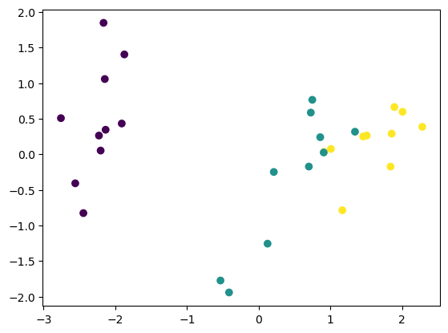
    


```python
plt.xlabel("Principal Component 1")
```


    Text(0.5, 0, 'Principal Component 1')


    
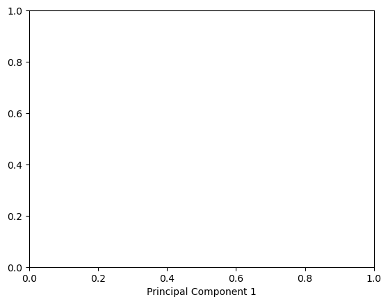
    


```python
plt.ylabel("Principal Component 2")
```


    Text(0, 0.5, 'Principal Component 2')


    
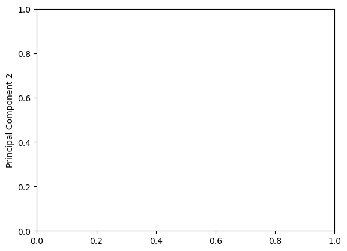
    


```python
plt.title("Iris Classification Using PCA")
```


    Text(0.5, 1.0, 'Iris Classification Using PCA')


    
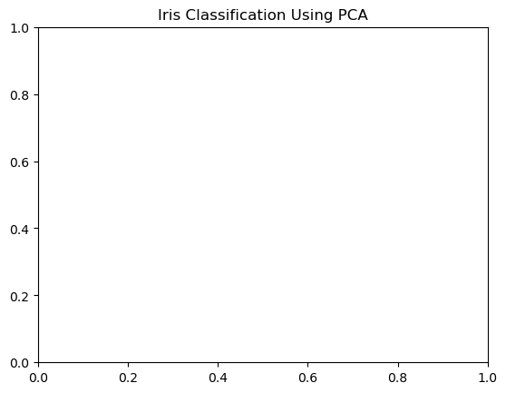
    


```python
plt.figure(figsize=(8, 6))

plt.scatter(
    X_test_pca[:, 0],
    X_test_pca[:, 1],
    c=y_test
)

plt.xlabel("Principal Component 1")
plt.ylabel("Principal Component 2")
plt.title("Iris Classification Using PCA - 24EU02035")
plt.grid()

plt.show()
```


    
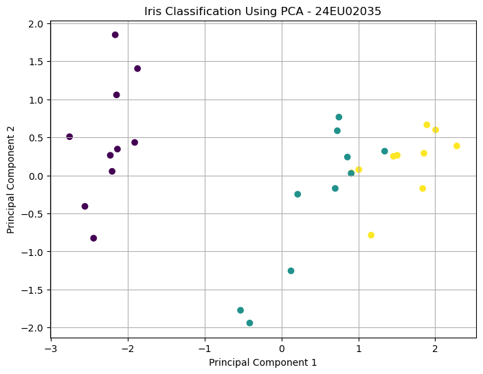
    


```python
import warnings
```


```python
warnings.filterwarnings("ignore")
```


```python
from sklearn.cluster import KMeans
```


```python
from sklearn.cluster import KMeans
```


```python
wcss = []
```


```python
k_range = range(1, 11)
```


```python
from sklearn.preprocessing import StandardScaler

scaler = StandardScaler()
X_scaled = scaler.fit_transform(X)
```


```python
for k in k_range:
    kmeans = KMeans(
        n_clusters=k,
        init='k-means++',
        random_state=42,
        n_init=10
    )
    kmeans.fit(X_scaled)
    wcss.append(kmeans.inertia_)
```


```python
plt.figure(figsize=(6, 4))
```


    <Figure size 600x400 with 0 Axes>


    <Figure size 600x400 with 0 Axes>


```python
plt.plot(k_range, wcss, marker='o', linestyle='--', color='darkblue')
```


    [<matplotlib.lines.Line2D at 0x1da5f690a10>]


    
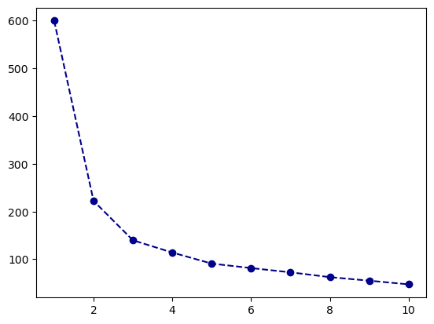
    


```python
plt.title("Elbow Method: Within-Cluster Sum of Squares (WCSS)")
```


    Text(0.5, 1.0, 'Elbow Method: Within-Cluster Sum of Squares (WCSS)')


    
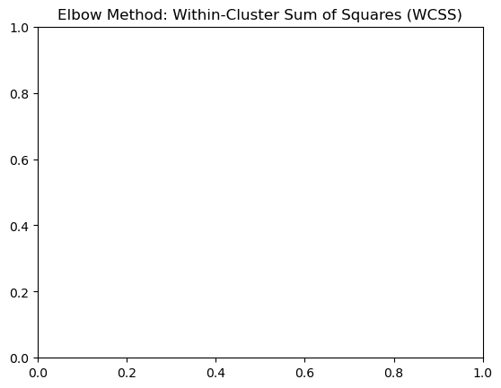
    


```python
plt.xlabel("Number of Clusters (k)")
```


    Text(0.5, 0, 'Number of Clusters (k)')


    
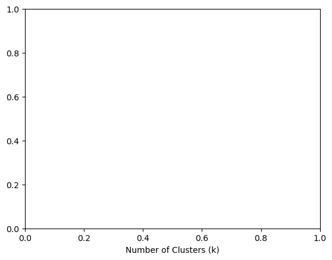
    


```python
plt.ylabel("WCSS (Inertia)")
```


    Text(0, 0.5, 'WCSS (Inertia)')


    
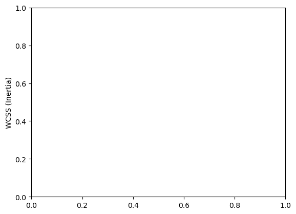
    


```python
plt.xticks(k_range)
```


    ([<matplotlib.axis.XTick at 0x1da61181c70>,
      <matplotlib.axis.XTick at 0x1da61180830>,
      <matplotlib.axis.XTick at 0x1da61182480>,
      <matplotlib.axis.XTick at 0x1da611956d0>,
      <matplotlib.axis.XTick at 0x1da61195910>,
      <matplotlib.axis.XTick at 0x1da611b8d40>,
      <matplotlib.axis.XTick at 0x1da611b9670>,
      <matplotlib.axis.XTick at 0x1da611b9f70>,
      <matplotlib.axis.XTick at 0x1da611ba930>,
      <matplotlib.axis.XTick at 0x1da611bb290>],
     [Text(1, 0, '1'),
      Text(2, 0, '2'),
      Text(3, 0, '3'),
      Text(4, 0, '4'),
      Text(5, 0, '5'),
      Text(6, 0, '6'),
      Text(7, 0, '7'),
      Text(8, 0, '8'),
      Text(9, 0, '9'),
      Text(10, 0, '10')])


    
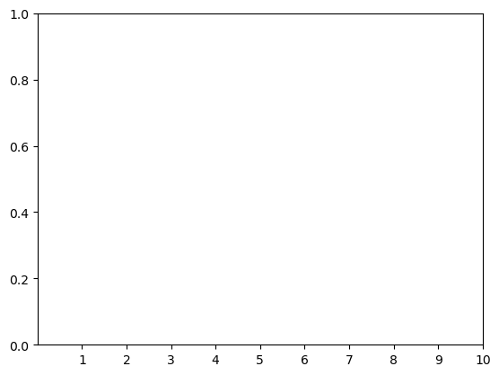
    


```python
plt.figure(figsize=(6, 4))
plt.plot(k_range, wcss, marker='o', linestyle='--', color='darkblue')
plt.title("Elbow Method: Within-Cluster Sum of Squares (WCSS) - 24EU02035")
plt.xlabel("Number of Clusters (k)")
plt.ylabel("WCSS (Inertia)")
plt.xticks(k_range)
plt.show()
```


    
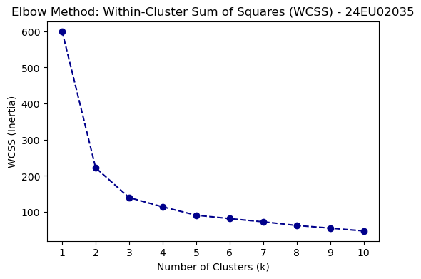
    


```python
from sklearn.metrics import silhouette_score
```


```python
silhouette_scores = []
```


```python
k_eval = range(2, 11)
```


```python
for k in k_eval:
    kmeans_temp = KMeans(n_clusters=k, init='k-means++', random_state=42, n_init=10)
    labels_temp = kmeans_temp.fit_predict(X_scaled)
    score = silhouette_score(X_scaled, labels_temp)
    silhouette_scores.append(score)
```


```python
plt.figure(figsize=(6, 4))
```


    <Figure size 600x400 with 0 Axes>


    <Figure size 600x400 with 0 Axes>


```python
import seaborn as sns
```


```python
sns.barplot(x=list(k_eval), y=silhouette_scores, palette='mako')
```


    <Axes: >


    
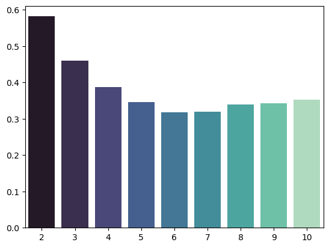
    


```python
plt.ylabel("Average Silhouette Coefficient")
```


    Text(0, 0.5, 'Average Silhouette Coefficient')


    
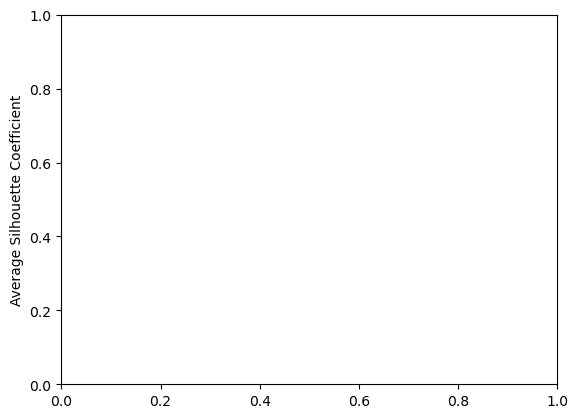
    


```python
plt.figure(figsize=(6, 4))
sns.barplot(x=list(k_eval), y=silhouette_scores, palette='mako')
plt.title("Silhouette Analyssns.barplot(x=list(k_eval), y=silhouette_scores, palette='mako')is for Optimal k - 24EU02035")
plt.xlabel("Number of Clusters (k)")
plt.ylabel("Average Silhouette Coefficient")
plt.show()
```


    
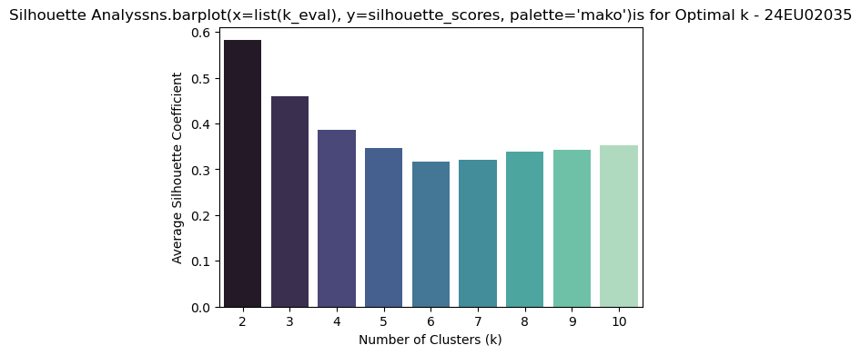
    


```python
import numpy as np
import matplotlib.pyplot as plt
import seaborn as sns
from sklearn.cluster import KMeans
from sklearn.metrics import silhouette_score
```


```python
best_k = k_eval[np.argmax(silhouette_scores)]
```


```python
print(f"k = {best_k} yielded the highest silhouette coefficient ({max(silhouette_scores):.4f}).")

```

    k = 2 yielded the highest silhouette coefficient (0.5818).
    


```python
print(f"k = {best_k} yielded the highest silhouette coefficient ({max(silhouette_scores):.4f}).")

```

    k = 2 yielded the highest silhouette coefficient (0.5818).
    


```python
from sklearn.cluster import KMeans
```


```python
kmeans_raw = KMeans(n_clusters=3, init='k-means++', random_state=42, n_init=10)
```


```python
kmeans_raw_labels = kmeans_raw.fit_predict(X_scaled)
```


```python
from sklearn.datasets import load_iris
```


```python
iris_df = pd.DataFrame(
    iris.data,
    columns=iris.feature_names
)
```


```python
iris_df['species_name'] = [
    iris.target_names[i] for i in iris.target
]
```


```python
iris_df['cluster_raw'] = kmeans_raw_labels
```


```python
print("K-Means clustering complete. First 5 sample allocations:")
```

    K-Means clustering complete. First 5 sample allocations:
    


```python
print(iris_df[['species_name', 'cluster_raw']].head(5))

```

      species_name  cluster_raw
    0       setosa            1
    1       setosa            1
    2       setosa            1
    3       setosa            1
    4       setosa            1
    


```python
raw_centroids_scaled = kmeans_raw.cluster_centers_
```


```python
raw_centroids_physical = scaler.inverse_transform(raw_centroids_scaled)

```


```python
features = [
    'sepal length (cm)',
    'sepal width (cm)',
    'petal length (cm)',
    'petal width (cm)'
]
```


```python
centroids_df = pd.DataFrame(data=raw_centroids_physical, columns=features)
```


```python
centroids_df.index = [f"Cluster_{i}" for i in range(3)]
```


```python
print("--- Estimated Cluster Centroids (Original Physical Units - cm) ---")

```

    --- Estimated Cluster Centroids (Original Physical Units - cm) ---
    


```python
print(centroids_df)
```

               sepal length (cm)  sepal width (cm)  petal length (cm)  \
    Cluster_0           5.801887          2.673585           4.369811   
    Cluster_1           5.006000          3.428000           1.462000   
    Cluster_2           6.780851          3.095745           5.510638   
    
               petal width (cm)  
    Cluster_0          1.413208  
    Cluster_1          0.246000  
    Cluster_2          1.972340  
    


```python
plt.figure(figsize=(6, 4))
```


    <Figure size 600x400 with 0 Axes>


    <Figure size 600x400 with 0 Axes>


```python
raw_data = scaler.inverse_transform(X_scaled)
```


```python
sns.scatterplot(x=raw_data[:, 2], y=raw_data[:, 3], hue=kmeans_raw_labels, palette='viridis', s=55, legend='full')
```


    <Axes: >


    
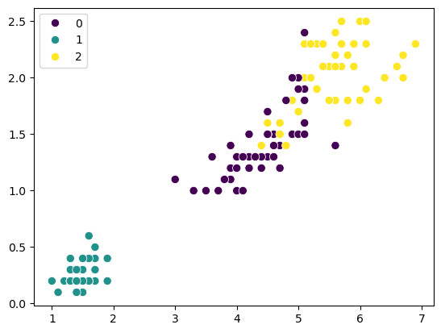
    


```python
plt.scatter(
    raw_centroids_physical[:, 2],
    raw_centroids_physical[:, 3],
    color='red',
    marker='X',
    s=150,
    label='Centroids'
)
```


    <matplotlib.collections.PathCollection at 0x1da63053f80>


    
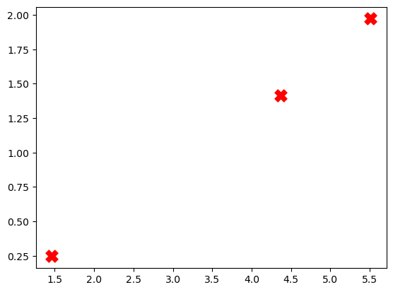
    


```python
plt.title("K-Means Clustering: Petal Width vs. Petal Length")
```


    Text(0.5, 1.0, 'K-Means Clustering: Petal Width vs. Petal Length')


    
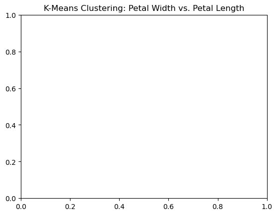
    


```python
plt.xlabel("Petal Length (cm)")
```


    Text(0.5, 0, 'Petal Length (cm)')


    
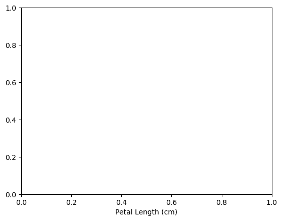
    


```python
plt.ylabel("Petal Width (cm)")
```


    Text(0, 0.5, 'Petal Width (cm)')


    
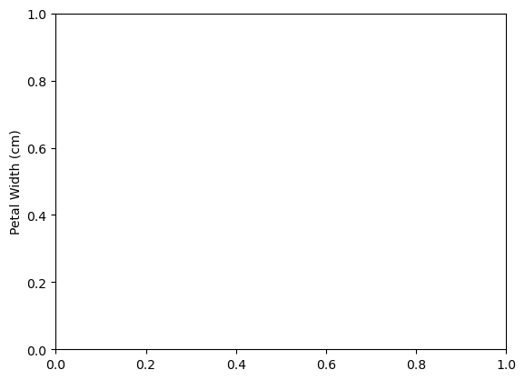
    


```python
plt.title("K-Means Clustering: Petal Width vs. Petal Length - 24EU02035")
plt.xlabel("Petal Length (cm)")
plt.ylabel("Petal Width (cm)")
plt.legend()
plt.show()

```

    No artists with labels found to put in legend.  Note that artists whose label start with an underscore are ignored when legend() is called with no argument.
    


    
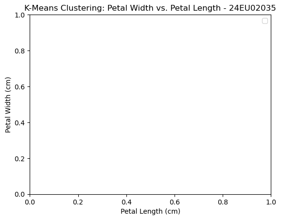
    


```python
plt.scatter(
    raw_centroids_physical[:, 2],
    raw_centroids_physical[:, 3],
    color='red',
    marker='X',
    s=150,
    label='Centroids'
)

plt.title("K-Means Clustering: Petal Width vs. Petal Length")
plt.xlabel("Petal Length (cm)")
plt.ylabel("Petal Width (cm)")
plt.legend()
plt.show()
```


    
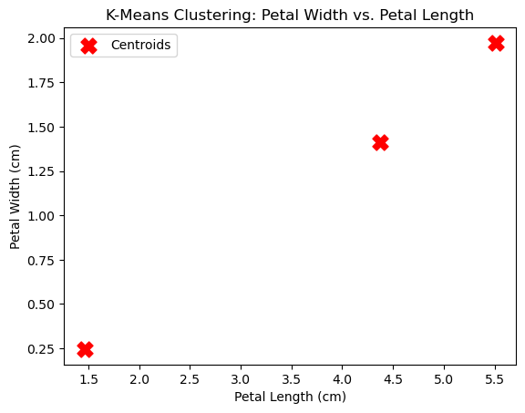
    


```python
plt.figure(figsize=(6, 4))

# Convert standardized centroids to original units for plotting
raw_data = scaler.inverse_transform(X_scaled)

# Plot the continuous data points colored by cluster assignment
sns.scatterplot(x=raw_data[:, 2], y=raw_data[:, 3], hue=kmeans_raw_labels, palette='viridis', s=55, legend='full')

# Plot the calculated centroids on the same canvas
plt.scatter(
    raw_centroids_physical[:, 2],
    raw_centroids_physical[:, 3],
    color='red',
    marker='X',
    s=150,
    label='Centroids'
)

plt.title("K-Means Clustering: Petal Width vs. Petal Length - 24EU02035")
plt.xlabel("Petal Length (cm)")
plt.ylabel("Petal Width (cm)")
plt.legend()
plt.show()
```


    
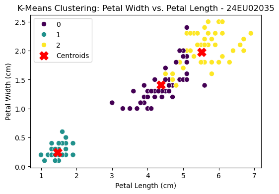
    


```python
import warnings
```


```python
warnings.filterwarnings("ignore")
```


```python
from sklearn.cluster import KMeans
```


```python
kmeans_pca = KMeans(n_clusters=3, init='k-means++', random_state=42, n_init=10)
```


```python
from sklearn.decomposition import PCA
```


```python
scaler = StandardScaler()
```


```python
pca = PCA(n_components=2)
```


```python
X_pca = pca.fit_transform(X_scaled)
```


```python
print("PCA transformation completed.")
```

    PCA transformation completed.
    


```python
print("X_pca shape:", X_pca.shape)
```

    X_pca shape: (150, 2)
    


```python
kmeans_pca = KMeans(n_clusters=3, init='k-means++', random_state=42, n_init=10)
kmeans_pca_labels = kmeans_pca.fit_predict(X_pca)
```


```python
iris_df['cluster_pca'] = kmeans_pca_labels
```


```python
print("PCA space K-Means clustering completed successfully.")
```

    PCA space K-Means clustering completed successfully.
    


```python
from sklearn.metrics import silhouette_score, calinski_harabasz_score
```


```python
sil_raw = silhouette_score(X_scaled, kmeans_raw_labels)
```


```python
ch_raw = calinski_harabasz_score(X_scaled, kmeans_raw_labels)
```


```python
sil_pca = silhouette_score(X_pca, kmeans_pca_labels)
```


```python
ch_pca = calinski_harabasz_score(X_pca, kmeans_pca_labels)
```


```python
print("--- Internal Validation (Unsupervised Quality Metrics) ---")
```

    --- Internal Validation (Unsupervised Quality Metrics) ---
    


```python
print(f"Raw 4D Feature Space  -> Silhouette Score: {sil_raw:.4f} | Calinski-Harabasz: {ch_raw:.2f}")
```

    Raw 4D Feature Space  -> Silhouette Score: 0.4599 | Calinski-Harabasz: 241.90
    


```python
print(f"PCA 2D Reduced Space -> Silhouette Score: {sil_pca:.4f} | Calinski-Harabasz: {ch_pca:.2f}")
```

    PCA 2D Reduced Space -> Silhouette Score: 0.5092 | Calinski-Harabasz: 293.86
    


```python
import matplotlib.pyplot as plt
```


```python
import seaborn as sns
```


```python
fig, axes = plt.subplots(1, 2, figsize=(14, 5))
```


    

    


```python
import pandas as pd
import matplotlib.pyplot as plt
import seaborn as sns
```


```python
from sklearn.decomposition import PCA
from sklearn.cluster import KMeans
```


```python
from sklearn.datasets import load_iris
from sklearn.preprocessing import StandardScaler
from sklearn.decomposition import PCA
from sklearn.cluster import KMeans
```


```python
iris = load_iris()
```


```python
X = iris.data
```


```python
scaler = StandardScaler()
```


```python
X_scaled = scaler.fit_transform(X)
```


```python
pca = PCA(n_components=2)
```


```python
X_pca = pca.fit_transform(X_scaled)
```


```python
pca_df = pd.DataFrame(
    X_pca,
    columns=['PC1', 'PC2']
)
```


```python
kmeans = KMeans(
    n_clusters=3,
    init='k-means++',
    random_state=42,
    n_init=10
)
```


```python
kmeans_pca_labels = kmeans.fit_predict(X_scaled)
```


```python
pca_df['Cluster'] = kmeans_pca_labels
```


```python
pca_df['species_name'] = [
    iris.target_names[i] for i in iris.target
]
```


```python
fig, axes = plt.subplots(1, 2, figsize=(14, 5))
```


    
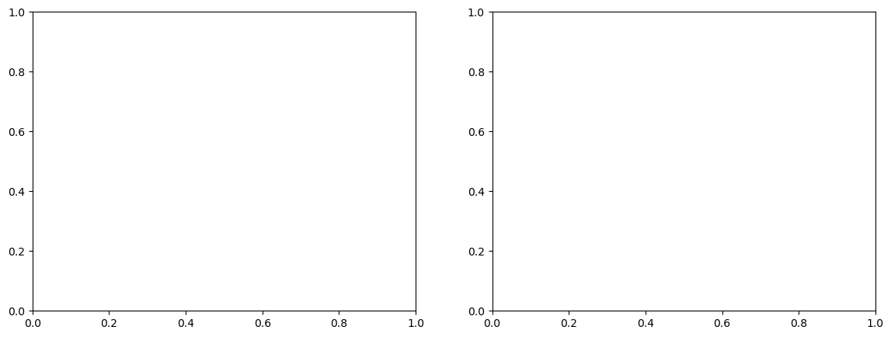
    


```python
sns.scatterplot(
    data=pca_df,
    x='PC1',
    y='PC2',
    hue='Cluster',
    palette='viridis',
    s=60,
    ax=axes[0]
)
```


    <Axes: xlabel='PC1', ylabel='PC2'>


```python
axes[0].set_title("K-Means Cluster Assignments (PCA Space)")
```


    Text(0.5, 1.0, 'K-Means Cluster Assignments (PCA Space)')


```python
axes[0].set_xlabel("PC1")
```


    Text(0.5, 4.444444444444445, 'PC1')


```python
axes[0].set_ylabel("PC2")
```


    Text(4.444444444444452, 0.5, 'PC2')


```python
axes[0].legend(title="Cluster")
```


    <matplotlib.legend.Legend at 0x1da654aa7e0>


```python
sns.scatterplot(
    data=pca_df,
    x='PC1',
    y='PC2',
    hue='species_name',
    palette='Set1',
    s=60,
    ax=axes[1]
)
```


    <Axes: xlabel='PC1', ylabel='PC2'>


```python
axes[1].set_title("True Taxonomic Species Labels")
```


    Text(0.5, 1.0, 'True Taxonomic Species Labels')


```python
axes[1].set_xlabel("PC1")
```


    Text(0.5, 4.444444444444445, 'PC1')


```python
axes[1].set_ylabel("PC2")
```


    Text(596.2626262626262, 0.5, 'PC2')


```python
axes[1].legend(title="True Species")
```


    <matplotlib.legend.Legend at 0x1da65478bc0>


```python
# -----------------------------
# Plot graphs
# -----------------------------
fig, axes = plt.subplots(1, 2, figsize=(14, 5))

# K-Means clusters
sns.scatterplot(
    data=pca_df,
    x='PC1',
    y='PC2',
    hue='Cluster',
    palette='viridis',
    s=60,
    ax=axes[0]
)

axes[0].set_title("K-Means Cluster Assignments (PCA Space) - 24EU02035")
axes[0].set_xlabel("PC1")
axes[0].set_ylabel("PC2")
axes[0].legend(title="Cluster")

# True species
sns.scatterplot(
    data=pca_df,
    x='PC1',
    y='PC2',
    hue='species_name',
    palette='Set1',
    s=60,
    ax=axes[1]
)

axes[1].set_title("True Taxonomic Species Labels - 24EU02035")
axes[1].set_xlabel("PC1")
axes[1].set_ylabel("PC2")
axes[1].legend(title="True Species")

plt.tight_layout()
plt.show()
```


    
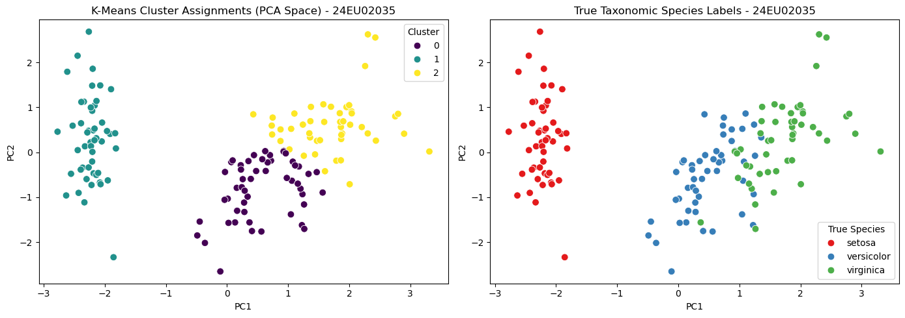
    


```python

```
