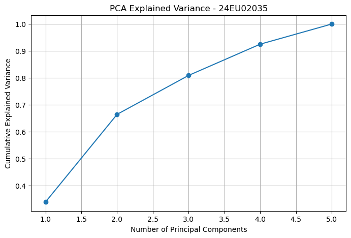
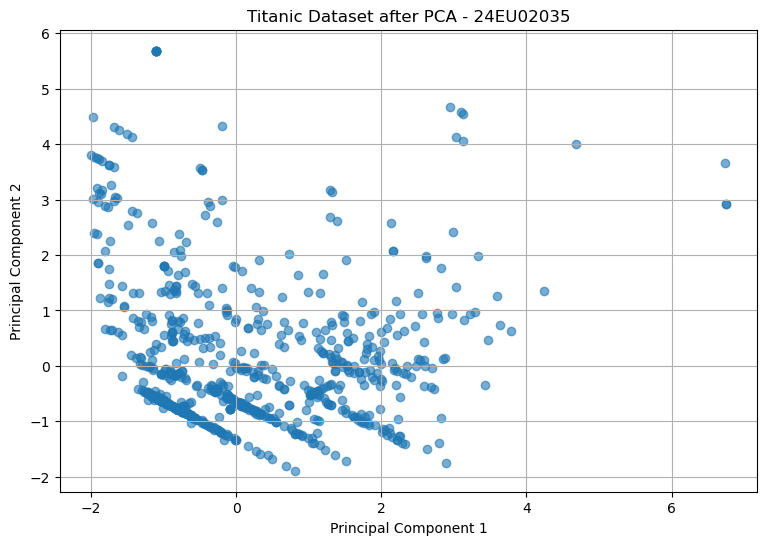
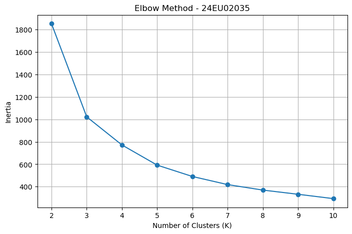
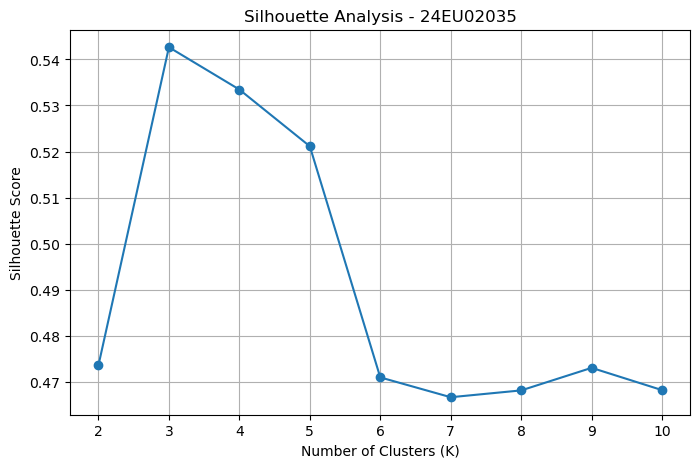
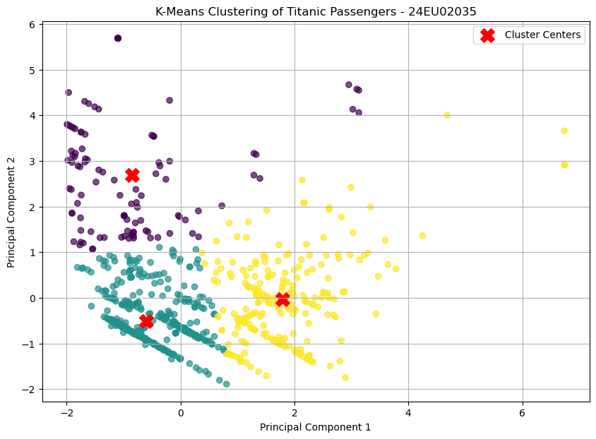
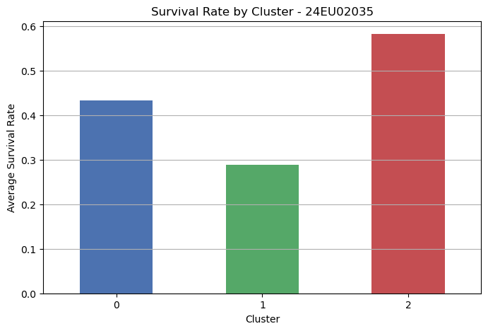

```python
import pandas as pd
import numpy as np
import matplotlib.pyplot as plt
import seaborn as sns

from sklearn.preprocessing import StandardScaler
from sklearn.decomposition import PCA
from sklearn.cluster import KMeans
from sklearn.metrics import silhouette_score

# ---------------------------------------------------------
# 1. Load Titanic Dataset
# ---------------------------------------------------------
df = sns.load_dataset("titanic")

print(df.head())
print("\nShape:", df.shape)
print("\nDataset Information:")
print(df.info())

# ---------------------------------------------------------
# 2. Data Preprocessing
# ---------------------------------------------------------
features = [
    "pclass",
    "age",
    "sibsp",
    "parch",
    "fare"
]

X = df[features].copy()

# Fill missing age values with median
X["age"] = X["age"].fillna(X["age"].median())

print("\nMissing Values:")
print(X.isnull().sum())

# ---------------------------------------------------------
# 3. Standardize the Data
# ---------------------------------------------------------
scaler = StandardScaler()
X_scaled = scaler.fit_transform(X)

print("\nStandardized Data:")
print(X_scaled[:5])

# ---------------------------------------------------------
# 4. PCA - All Components
# ---------------------------------------------------------
pca = PCA()
X_pca = pca.fit_transform(X_scaled)

explained_variance = pca.explained_variance_ratio_

print("\nExplained Variance Ratio:")
print(explained_variance)

print("\nCumulative Explained Variance:")
print(np.cumsum(explained_variance))

# ---------------------------------------------------------
# 5. PCA Explained Variance Graph
# ---------------------------------------------------------
plt.figure(figsize=(8, 5))

plt.plot(
    range(1, len(explained_variance) + 1),
    np.cumsum(explained_variance),
    marker="o"
)

plt.xlabel("Number of Principal Components")
plt.ylabel("Cumulative Explained Variance")
plt.title("PCA Explained Variance - 24EU02035")
plt.grid(True)
plt.show()

# ---------------------------------------------------------
# 6. PCA - Reduce to 2 Components
# ---------------------------------------------------------
pca_2 = PCA(n_components=2)
X_pca_2 = pca_2.fit_transform(X_scaled)

print("\nVariance Explained by PC1 and PC2:")
print(pca_2.explained_variance_ratio_)

print("\nTotal Variance Explained:")
print(pca_2.explained_variance_ratio_.sum())

# ---------------------------------------------------------
# 7. PCA Scatter Plot
# ---------------------------------------------------------
plt.figure(figsize=(9, 6))

plt.scatter(
    X_pca_2[:, 0],
    X_pca_2[:, 1],
    alpha=0.6
)

plt.xlabel("Principal Component 1")
plt.ylabel("Principal Component 2")
plt.title("Titanic Dataset after PCA - 24EU02035")
plt.grid(True)
plt.show()

# ---------------------------------------------------------
# 8. K-Means - Elbow Method
# ---------------------------------------------------------
inertia = []

for k in range(2, 11):
    kmeans = KMeans(
        n_clusters=k,
        random_state=42,
        n_init=10
    )

    kmeans.fit(X_pca_2)
    inertia.append(kmeans.inertia_)

plt.figure(figsize=(8, 5))

plt.plot(
    range(2, 11),
    inertia,
    marker="o"
)

plt.xlabel("Number of Clusters (K)")
plt.ylabel("Inertia")
plt.title("Elbow Method - 24EU02035")
plt.grid(True)
plt.show()

# ---------------------------------------------------------
# 9. Silhouette Score
# ---------------------------------------------------------
silhouette_scores = []

for k in range(2, 11):
    kmeans = KMeans(
        n_clusters=k,
        random_state=42,
        n_init=10
    )

    labels = kmeans.fit_predict(X_pca_2)

    score = silhouette_score(X_pca_2, labels)
    silhouette_scores.append(score)

plt.figure(figsize=(8, 5))

plt.plot(
    range(2, 11),
    silhouette_scores,
    marker="o"
)

plt.xlabel("Number of Clusters (K)")
plt.ylabel("Silhouette Score")
plt.title("Silhouette Analysis - 24EU02035")
plt.grid(True)
plt.show()

print("\nSilhouette Scores:")
for k, score in zip(range(2, 11), silhouette_scores):
    print(f"K = {k}: {score:.3f}")

# ---------------------------------------------------------
# 10. Apply K-Means Clustering
# ---------------------------------------------------------
# Using K = 3 for clustering
kmeans = KMeans(
    n_clusters=3,
    random_state=42,
    n_init=10
)

clusters = kmeans.fit_predict(X_pca_2)

df["Cluster"] = clusters

print("\nCluster Assignments:")
print(df[["pclass", "age", "sibsp", "parch", "fare", "Cluster"]].head(20))

# ---------------------------------------------------------
# 11. Visualize Clusters
# ---------------------------------------------------------
plt.figure(figsize=(10, 7))

plt.scatter(
    X_pca_2[:, 0],
    X_pca_2[:, 1],
    c=clusters,
    cmap="viridis",
    alpha=0.7
)

# Cluster centers
centers = kmeans.cluster_centers_

plt.scatter(
    centers[:, 0],
    centers[:, 1],
    c="red",
    marker="X",
    s=200,
    label="Cluster Centers"
)

plt.xlabel("Principal Component 1")
plt.ylabel("Principal Component 2")
plt.title("K-Means Clustering of Titanic Passengers - 24EU02035")
plt.legend()
plt.grid(True)
plt.show()

# ---------------------------------------------------------
# 12. Cluster Analysis
# ---------------------------------------------------------
cluster_summary = df.groupby("Cluster")[features].mean()

print("\nCluster Summary:")
print(cluster_summary)

# Number of passengers in each cluster
print("\nNumber of Passengers in Each Cluster:")
print(df["Cluster"].value_counts().sort_index())

# ---------------------------------------------------------
# 13. Compare Clusters with Survival
# ---------------------------------------------------------
survival_by_cluster = df.groupby("Cluster")["survived"].mean()

print("\nSurvival Rate by Cluster:")
print(survival_by_cluster)

# ---------------------------------------------------------
# 14. Survival Rate Graph
# ---------------------------------------------------------
plt.figure(figsize=(8, 5))

survival_by_cluster.plot(
    kind="bar",
    color=["#4C72B0", "#55A868", "#C44E52"]
)

plt.xlabel("Cluster")
plt.ylabel("Average Survival Rate")
plt.title("Survival Rate by Cluster - 24EU02035")
plt.xticks(rotation=0)
plt.grid(axis="y")
plt.show()

```

       survived  pclass     sex   age  sibsp  parch     fare embarked  class  \
    0         0       3    male  22.0      1      0   7.2500        S  Third   
    1         1       1  female  38.0      1      0  71.2833        C  First   
    2         1       3  female  26.0      0      0   7.9250        S  Third   
    3         1       1  female  35.0      1      0  53.1000        S  First   
    4         0       3    male  35.0      0      0   8.0500        S  Third   
    
         who  adult_male deck  embark_town alive  alone  
    0    man        True  NaN  Southampton    no  False  
    1  woman       False    C    Cherbourg   yes  False  
    2  woman       False  NaN  Southampton   yes   True  
    3  woman       False    C  Southampton   yes  False  
    4    man        True  NaN  Southampton    no   True  
    
    Shape: (891, 15)
    
    Dataset Information:
    <class 'pandas.core.frame.DataFrame'>
    RangeIndex: 891 entries, 0 to 890
    Data columns (total 15 columns):
     #   Column       Non-Null Count  Dtype   
    ---  ------       --------------  -----   
     0   survived     891 non-null    int64   
     1   pclass       891 non-null    int64   
     2   sex          891 non-null    object  
     3   age          714 non-null    float64 
     4   sibsp        891 non-null    int64   
     5   parch        891 non-null    int64   
     6   fare         891 non-null    float64 
     7   embarked     889 non-null    object  
     8   class        891 non-null    category
     9   who          891 non-null    object  
     10  adult_male   891 non-null    bool    
     11  deck         203 non-null    category
     12  embark_town  889 non-null    object  
     13  alive        891 non-null    object  
     14  alone        891 non-null    bool    
    dtypes: bool(2), category(2), float64(2), int64(4), object(5)
    memory usage: 80.7+ KB
    None
    
    Missing Values:
    pclass    0
    age       0
    sibsp     0
    parch     0
    fare      0
    dtype: int64
    
    Standardized Data:
    [[ 0.82737724 -0.56573646  0.43279337 -0.47367361 -0.50244517]
     [-1.56610693  0.66386103  0.43279337 -0.47367361  0.78684529]
     [ 0.82737724 -0.25833709 -0.4745452  -0.47367361 -0.48885426]
     [-1.56610693  0.4333115   0.43279337 -0.47367361  0.42073024]
     [ 0.82737724  0.4333115  -0.4745452  -0.47367361 -0.48633742]]
    
    Explained Variance Ratio:
    [0.33960812 0.32520788 0.14457332 0.11586011 0.07475057]
    
    Cumulative Explained Variance:
    [0.33960812 0.664816   0.80938932 0.92524943 1.        ]
    


    

    


    
    Variance Explained by PC1 and PC2:
    [0.33960812 0.32520788]
    
    Total Variance Explained:
    0.6648159969553278
    


    

    


    C:\ProgramData\anaconda3\Lib\site-packages\sklearn\cluster\_kmeans.py:1446: UserWarning: KMeans is known to have a memory leak on Windows with MKL, when there are less chunks than available threads. You can avoid it by setting the environment variable OMP_NUM_THREADS=4.
      warnings.warn(
    C:\ProgramData\anaconda3\Lib\site-packages\sklearn\cluster\_kmeans.py:1446: UserWarning: KMeans is known to have a memory leak on Windows with MKL, when there are less chunks than available threads. You can avoid it by setting the environment variable OMP_NUM_THREADS=4.
      warnings.warn(
    C:\ProgramData\anaconda3\Lib\site-packages\sklearn\cluster\_kmeans.py:1446: UserWarning: KMeans is known to have a memory leak on Windows with MKL, when there are less chunks than available threads. You can avoid it by setting the environment variable OMP_NUM_THREADS=4.
      warnings.warn(
    C:\ProgramData\anaconda3\Lib\site-packages\sklearn\cluster\_kmeans.py:1446: UserWarning: KMeans is known to have a memory leak on Windows with MKL, when there are less chunks than available threads. You can avoid it by setting the environment variable OMP_NUM_THREADS=4.
      warnings.warn(
    C:\ProgramData\anaconda3\Lib\site-packages\sklearn\cluster\_kmeans.py:1446: UserWarning: KMeans is known to have a memory leak on Windows with MKL, when there are less chunks than available threads. You can avoid it by setting the environment variable OMP_NUM_THREADS=4.
      warnings.warn(
    C:\ProgramData\anaconda3\Lib\site-packages\sklearn\cluster\_kmeans.py:1446: UserWarning: KMeans is known to have a memory leak on Windows with MKL, when there are less chunks than available threads. You can avoid it by setting the environment variable OMP_NUM_THREADS=4.
      warnings.warn(
    C:\ProgramData\anaconda3\Lib\site-packages\sklearn\cluster\_kmeans.py:1446: UserWarning: KMeans is known to have a memory leak on Windows with MKL, when there are less chunks than available threads. You can avoid it by setting the environment variable OMP_NUM_THREADS=4.
      warnings.warn(
    C:\ProgramData\anaconda3\Lib\site-packages\sklearn\cluster\_kmeans.py:1446: UserWarning: KMeans is known to have a memory leak on Windows with MKL, when there are less chunks than available threads. You can avoid it by setting the environment variable OMP_NUM_THREADS=4.
      warnings.warn(
    C:\ProgramData\anaconda3\Lib\site-packages\sklearn\cluster\_kmeans.py:1446: UserWarning: KMeans is known to have a memory leak on Windows with MKL, when there are less chunks than available threads. You can avoid it by setting the environment variable OMP_NUM_THREADS=4.
      warnings.warn(
    


    

    


    C:\ProgramData\anaconda3\Lib\site-packages\sklearn\cluster\_kmeans.py:1446: UserWarning: KMeans is known to have a memory leak on Windows with MKL, when there are less chunks than available threads. You can avoid it by setting the environment variable OMP_NUM_THREADS=4.
      warnings.warn(
    C:\ProgramData\anaconda3\Lib\site-packages\sklearn\cluster\_kmeans.py:1446: UserWarning: KMeans is known to have a memory leak on Windows with MKL, when there are less chunks than available threads. You can avoid it by setting the environment variable OMP_NUM_THREADS=4.
      warnings.warn(
    C:\ProgramData\anaconda3\Lib\site-packages\sklearn\cluster\_kmeans.py:1446: UserWarning: KMeans is known to have a memory leak on Windows with MKL, when there are less chunks than available threads. You can avoid it by setting the environment variable OMP_NUM_THREADS=4.
      warnings.warn(
    C:\ProgramData\anaconda3\Lib\site-packages\sklearn\cluster\_kmeans.py:1446: UserWarning: KMeans is known to have a memory leak on Windows with MKL, when there are less chunks than available threads. You can avoid it by setting the environment variable OMP_NUM_THREADS=4.
      warnings.warn(
    C:\ProgramData\anaconda3\Lib\site-packages\sklearn\cluster\_kmeans.py:1446: UserWarning: KMeans is known to have a memory leak on Windows with MKL, when there are less chunks than available threads. You can avoid it by setting the environment variable OMP_NUM_THREADS=4.
      warnings.warn(
    C:\ProgramData\anaconda3\Lib\site-packages\sklearn\cluster\_kmeans.py:1446: UserWarning: KMeans is known to have a memory leak on Windows with MKL, when there are less chunks than available threads. You can avoid it by setting the environment variable OMP_NUM_THREADS=4.
      warnings.warn(
    C:\ProgramData\anaconda3\Lib\site-packages\sklearn\cluster\_kmeans.py:1446: UserWarning: KMeans is known to have a memory leak on Windows with MKL, when there are less chunks than available threads. You can avoid it by setting the environment variable OMP_NUM_THREADS=4.
      warnings.warn(
    C:\ProgramData\anaconda3\Lib\site-packages\sklearn\cluster\_kmeans.py:1446: UserWarning: KMeans is known to have a memory leak on Windows with MKL, when there are less chunks than available threads. You can avoid it by setting the environment variable OMP_NUM_THREADS=4.
      warnings.warn(
    C:\ProgramData\anaconda3\Lib\site-packages\sklearn\cluster\_kmeans.py:1446: UserWarning: KMeans is known to have a memory leak on Windows with MKL, when there are less chunks than available threads. You can avoid it by setting the environment variable OMP_NUM_THREADS=4.
      warnings.warn(
    


    

    


    
    Silhouette Scores:
    K = 2: 0.474
    K = 3: 0.543
    K = 4: 0.533
    K = 5: 0.521
    K = 6: 0.471
    K = 7: 0.467
    K = 8: 0.468
    K = 9: 0.473
    K = 10: 0.468
    

    C:\ProgramData\anaconda3\Lib\site-packages\sklearn\cluster\_kmeans.py:1446: UserWarning: KMeans is known to have a memory leak on Windows with MKL, when there are less chunks than available threads. You can avoid it by setting the environment variable OMP_NUM_THREADS=4.
      warnings.warn(
    

    
    Cluster Assignments:
        pclass   age  sibsp  parch     fare  Cluster
    0        3  22.0      1      0   7.2500        1
    1        1  38.0      1      0  71.2833        2
    2        3  26.0      0      0   7.9250        1
    3        1  35.0      1      0  53.1000        2
    4        3  35.0      0      0   8.0500        1
    5        3   NaN      0      0   8.4583        1
    6        1  54.0      0      0  51.8625        2
    7        3   2.0      3      1  21.0750        0
    8        3  27.0      0      2  11.1333        1
    9        2  14.0      1      0  30.0708        1
    10       3   4.0      1      1  16.7000        0
    11       1  58.0      0      0  26.5500        2
    12       3  20.0      0      0   8.0500        1
    13       3  39.0      1      5  31.2750        0
    14       3  14.0      0      0   7.8542        1
    15       2  55.0      0      0  16.0000        2
    16       3   2.0      4      1  29.1250        0
    17       2   NaN      0      0  13.0000        1
    18       3  31.0      1      0  18.0000        1
    19       3   NaN      0      0   7.2250        1
    


    

    


    
    Cluster Summary:
               pclass        age     sibsp     parch       fare
    Cluster                                                    
    0        2.584906  12.642473  2.415094  1.924528  47.020794
    1        2.761818  27.873606  0.225455  0.121818  12.277574
    2        1.123404  41.141463  0.365957  0.293617  72.157784
    
    Number of Passengers in Each Cluster:
    Cluster
    0    106
    1    550
    2    235
    Name: count, dtype: int64
    
    Survival Rate by Cluster:
    Cluster
    0    0.433962
    1    0.289091
    2    0.582979
    Name: survived, dtype: float64
    


    

    


```python

```
